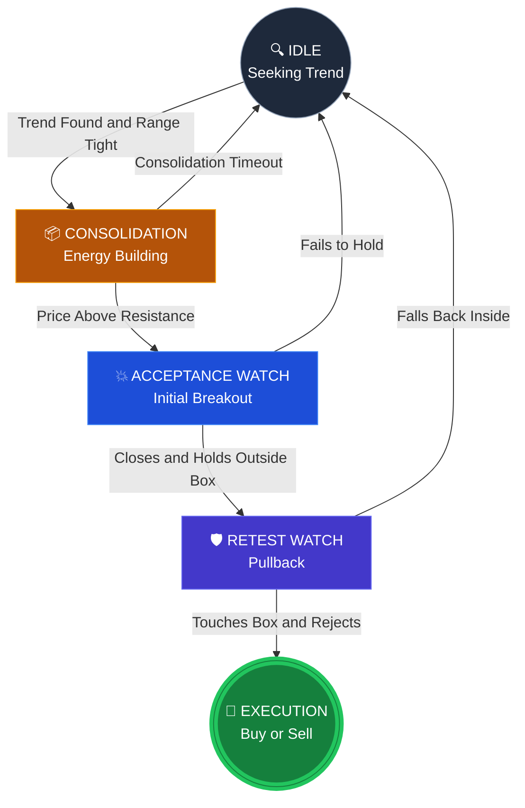

# Breakout Scanner Architecture

An institutional-grade, deterministic trading engine designed to isolate and execute high-probability structural breakouts across equities and crypto. The system strictly eliminates look-ahead bias and is backed by a robust Risk Engine, Paper Trading simulation, and Production Circuit Breakers.

## 🧠 System Architecture

The engine implements a strict state-machine flow inspired by Pine Script mechanics, migrating setups through rigorous validation checks.

`IDLE` → `CONSOLIDATION` → `ACCEPTANCE_WATCH` → `ACCEPTED_RETEST_WATCH` → `BUY/SELL`

### Trading Strategy (State Machine)


### Core Components
1. **The Breakout Engine (`engine.py`)**: The deterministic core. It computes ATR, Momentum, and Volume profiles bar-by-bar to evaluate structures.
2. **The Scanner (`scanner.py`)**: Manages the persistent memory state for N-symbols simultaneously.
3. **The Backtester (`backtester.py`)**: An event-driven historical simulation engine that loops bar-by-bar (O(N²)) to prevent any potential look-ahead bias.
4. **Risk Engine (`risk.py`)**: Calculates position sizing based on available account balance, risk per trade limits, and structural stop-losses.
5. **Paper Broker (`paper_broker.py`)**: A simulated execution environment that manages virtual balances, enforces maximum exposure constraints, and fills limit/stop orders.
6. **Production Safeguards (`safeguards.py`)**: The ultimate gatekeeper implementing Global Kill Switches, Daily Loss Limits, Liquidity checks, and Stale Data detection.
7. **The Dashboard (`dashboard.py`)**: A Flask-based Glassmorphism UI that visualizes real-time states and utilizes a "Prediction Chat" to explain exactly *why* the engine made a specific decision.

---

## ⚙️ Configuration (`config/default.yaml`)
All hyper-parameters are decoupled from the code and live in `default.yaml`. 

* **Structure**: Pivot lengths and trend validation.
* **Consolidation**: Maximum range percentages and time constraints.
* **Breakout**: Minimum push strength and volume anomalies required to trigger.
* **Risk**: Maximum daily drawdown, account exposure, and R:R ratios.

---

## 🚀 Execution Guide

### 1. Installation
```bash
python3 -m venv .venv
source .venv/bin/activate
pip install -r requirements.txt
```

### 2. Run the Local Dashboard
```bash
python3 dashboard.py
```
*Navigate to `http://127.0.0.1:5000` to view the UI.*

### 3. Run a Backtest
```bash
python3 run_backtest.py
```
*Results will automatically populate in the `/backtest` directory, generating equity curves, complete trade logs, and high-level `metrics.json`.*

### 4. Command Line Scanner
To run a one-off historical scan:
```bash
python3 -m breakout_scanner.cli scan --watchlist config/watchlist.txt --period 60d --interval 1h
```

---

## 🛡️ Safeguards & Phase 10 (Live Execution)
Before attaching live brokerage API keys (e.g., Alpaca, CCXT) for Phase 10, ensure that the `ProductionSafeguards` are correctly calibrated to your timezone and liquidity preferences. The engine is programmed to halt completely if daily loss limits are breached or data latency exceeds 120 seconds.

## Execution steps
The default input file where we store the stock names is located at: config/watchlist.txt

When you run python3 daily_report.py without any extra commands, it automatically reads the stock tickers from that specific file.

(Note: We also created config/crypto_watchlist.txt and config/top30_watchlist.txt earlier. If you want to use a different file, you just pass it in like this: python3 daily_report.py --watchlist config/your_custom_file.txt).
